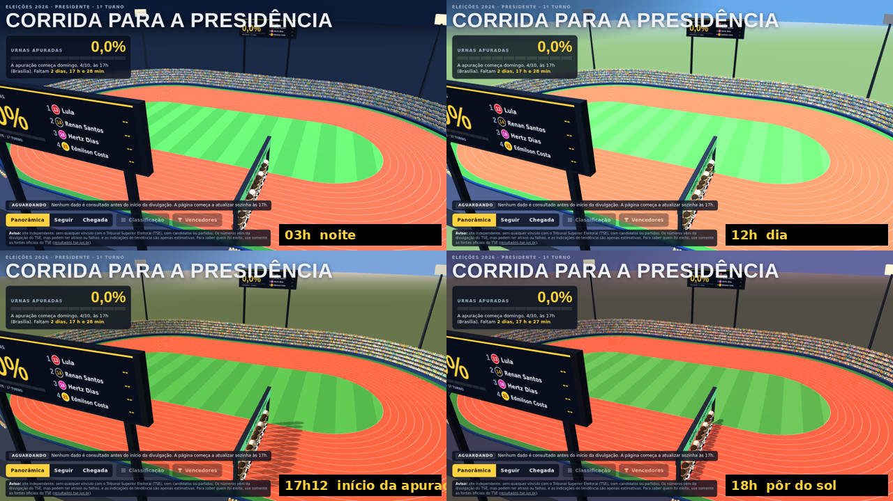
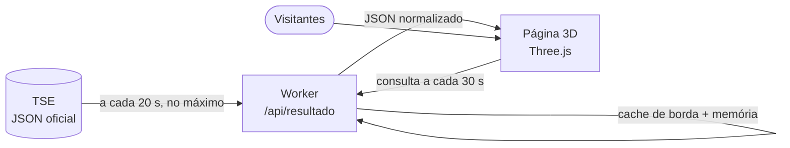

<div align="center">

# 🏃 Corrida para a Presidência

**Acompanhe a apuração das eleições presidenciais de 2026 como uma prova de atletismo em 3D.**

Cada candidato é um corredor. Quanto mais urnas apuradas, mais longe a prova avança.
Todos os números vêm da divulgação oficial do TSE.

[](https://developers.cloudflare.com/workers/)
[](https://threejs.org/)
[](https://resultados.tse.jus.br)
[](#-regras-da-corrida)

**🌐 [corridaparapresidencia.eleicoes.workers.dev](https://corridaparapresidencia.eleicoes.workers.dev)**


</div>

---

## ✨ O que é

Um painel de acompanhamento do **1º turno de 2026** (4 de outubro) em que a apuração vira uma corrida:

- uma **pista de atletismo** (piso vermelho, 13 raias, estádio com arquibancadas, telões e um pórtico com a faixa **SAÍDA** de um lado e **CHEGADA** do outro);
- **13 corredores** caricatos, um por candidato à Presidência, com a **camisa na cor do partido** e o **número de urna** do candidato;
- um **placar ao vivo** com a porcentagem de urnas apuradas, a classificação e um resumo do cenário (disputa aberta, tendência de 2º turno, vitória garantida);
- três câmeras (panorâmica, seguir o líder e chegada);
- botão **Classificação**, que se ativa assim que chega o primeiro dado do TSE, e botão **Vencedores**, com um **pódio 3D** do 1º e do 2º colocados no fim da apuração;
- um **céu que acompanha a hora** de quem está vendo: noite, amanhecer, dia, pôr do sol e anoitecer;
- **contagem regressiva** até o início da divulgação, domingo, 4/10, às 17h (Brasília).

> A página **não tem modo de demonstração**: antes do início da apuração os corredores ficam na largada, e assim que o TSE publica os primeiros dados a corrida começa sozinha, sem recarregar.

<div align="center">

</div>

## 📏 Regras da corrida

| Regra | Como funciona |
|---|---|
| **Uma volta = 100% das urnas** | A pista tem 1 volta completa. O líder fica na posição igual à porcentagem de urnas apuradas. |
| **Posição dos demais** | Proporcional aos votos: `posição = % apurada × votos do candidato ÷ votos do líder`. |
| **Número no corredor** | Cada corredor mostra a sua porcentagem de votos válidos, como o site do TSE. |
| **Classificação** | Pelos **votos válidos** de cada candidato. O botão fica desativado até chegar o primeiro dado de apuração do TSE, por menor que seja. |
| **Cenário** | *Garantido* quando a vantagem é maior que todo o eleitorado ainda não apurado; *tendência* quando supera o dobro dos votos válidos esperados no ritmo atual. Com 100% das urnas, vale o status oficial do TSE (Eleito / 2º turno). |
| **Botão "Vencedores"** | Abre um pódio 3D com o 1º (degrau mais alto) e o 2º colocados. Fica desativado até passar de **99%** das urnas apuradas; se a diferença entre o 1º e o 2º ainda estiver dentro da margem de incerteza dos votos que faltam (o maior entre 10% dos votos válidos restantes e 3,29 desvios-padrão do sorteio multinomial), só libera com **99,99%**. O resultado do pódio é parcial até o TSE divulgar o final. |

## 🌅 Céu conforme a hora

O céu, a luz do sol, as sombras, as estrelas e os refletores do estádio mudam com o **relógio de quem acessa**, com transições suaves:

| Hora local | Céu |
|---|---|
| 20h às 5h | noite, com estrelas e refletores acesos |
| 5h às 6h30 | amanhecer |
| 6h30 às 8h | nascer do sol |
| 8h às 16h30 | dia, com o sol cruzando o céu |
| 16h30 às 18h15 | fim de tarde e pôr do sol |
| 18h15 às 20h | anoitecer |

No domingo da eleição, a apuração começa por volta do pôr do sol, então quem acompanhar verá o estádio passar do fim de tarde para a noite.

<div align="center">

</div>

## 🗂️ De onde vêm os dados

O site lê o arquivo oficial de resultados do TSE para a eleição federal (presidente, 1º turno):

```
https://resultados.tse.jus.br/oficial/ele2026/6257/dados/br/br-c0001-e006257-u.json
```

O arquivo traz, entre outros campos, os candidatos em `carg > agr > par > cand` (número, nome, votos `vap`, percentual `pvap`, situação `st`) e o andamento da apuração em `s` (seções totalizadas `pst`, `ts`, `st`) e `e` (eleitorado).

## 🧱 Como funciona



- **`public/index.html`**: o site inteiro (3D, interface, candidatos, cores). Roda no navegador, sem build.
- **`src/worker.js`**: Worker da Cloudflare que busca o JSON do TSE, converte a vírgula decimal, normaliza os campos e guarda em cache. Assim, milhares de visitantes geram **no máximo uma consulta ao TSE a cada 20 segundos**, o que respeita o limite do TSE (bloqueio por IP em excesso de requisições).
- **Horário de início**: antes de domingo, 4/10, às 17h (Brasília), nem a página nem o Worker consultam o TSE; a página mostra a contagem regressiva. A rota `/api/verificar` lê o TSE a qualquer momento, para conferir manualmente que a leitura funciona.
- **Falhas do TSE**: o Worker devolve o último dado bom marcado como *"último dado"*; a página nunca inventa números. Se o TSE recusar a conexão, a página avisa que ele não está respondendo.
- **Robustez**: respostas atrasadas e mais antigas são descartadas (a corrida nunca anda para trás); percentuais ausentes são recalculados pelos votos; sem eleitorado total, o painel não faz projeções; cada consulta tem limite de 20 s.
- **Sem 3D**: se o navegador não suportar WebGL, os números, a classificação e o pódio continuam funcionando; o Three.js tem uma CDN reserva.
- **Atualização automática**: a página consulta o Worker a cada 30 segundos (e ao voltar para a aba), sem recarregar.

## 📁 Estrutura

```
.
├── public/
│   └── index.html          # site: cena 3D, UI, candidatos e cores
├── src/
│   └── worker.js           # /api/resultado, /api/status e /api/verificar (TSE → JSON enxuto)
├── docs/                   # imagens deste README
├── wrangler.jsonc          # configuração do Cloudflare Workers
├── verificar_site.py       # teste do site publicado
└── verificar_paleta.py     # confere contraste e daltonismo das cores
```

## 🔧 Variáveis do Worker

Em *Configurações → Variáveis e segredos* do Worker, sem mudar código:

| Variável | Para que serve |
|---|---|
| `TSE_URL` | URL do JSON do TSE, se o tribunal mudar o caminho do arquivo. |
| `TSE_START` | Início da divulgação (ISO 8601). Padrão: `2026-10-04T20:00:00Z` (17h de Brasília). Antes dele o Worker não consulta o TSE. |

A rota `/api/status` mostra a URL e o horário em uso; `/api/verificar` lê o TSE na hora, para conferência.

## 💻 Rodar localmente

```bash
# Worker + site em http://localhost:8787, apontando para o JSON oficial
npx wrangler dev

# ou apontando para um arquivo de teste seu, já liberado (sem esperar 4/10 17h)
npx wrangler dev --var TSE_URL:http://127.0.0.1:9911/br-c0001-e006257-u.json --var TSE_START:2026-01-01T00:00:00Z
```

## 🎨 Candidatos e cores

Cada candidato tem camisa, cor do número e cor secundária (mangas e calção) no bloco `CANDS` de `public/index.html`. As cores derivam das bandeiras dos partidos e foram conferidas em contraste (WCAG), distância de cor (CIEDE2000) e simulação de daltonismo:

```bash
python3 verificar_paleta.py
```

Os corredores são **personagens genéricos de desenho**, sem a pretensão de retratar o rosto de ninguém: variam apenas em porte, idade aparente, cabelo (ou ausência dele), barba e cor da camisa. A boca é a mesma, em curva simples, para todos.

## 🤖 Feito com IA

Todo o código deste projeto (cena 3D, interface, Worker, testes) foi escrito por **inteligência artificial** (Claude, da Anthropic), a partir de pedidos e revisões feitos em conversa. O objetivo foi **testar o que dá para construir assim**. Ajustes durante a apuração são esperados.

## ⚠️ Aviso

Este é um projeto **independente, sem qualquer vínculo com o Tribunal Superior Eleitoral (TSE)**, com candidatos ou partidos. Os números vêm da divulgação do TSE, mas podem ter atraso ou falhas, e as indicações de tendência são apenas estimativas. **Para saber quem foi eleito, use somente as fontes oficiais do TSE:** [resultados.tse.jus.br](https://resultados.tse.jus.br).

## 📚 Referências

- [TSE — Divulgação de Resultados](https://resultados.tse.jus.br)
- [Cloudflare Workers — Static Assets](https://developers.cloudflare.com/workers/static-assets/)
- [Cloudflare Workers — Cache API](https://developers.cloudflare.com/workers/runtime-apis/cache/)
- [Cloudflare Workers — Limites e preços](https://developers.cloudflare.com/workers/platform/limits/)
- [Three.js](https://threejs.org/)
- [WCAG 2.1 — Contraste (critério 1.4.3)](https://www.w3.org/TR/WCAG21/#contrast-minimum)
- Sharma, G.; Wu, W.; Dalal, E. N. *The CIEDE2000 color-difference formula*. Color Research & Application, 30(1), 2005.
- Machado, G. M.; Oliveira, M. M.; Fernandes, L. A. F. *A physiologically-based model for simulation of color vision deficiency*. IEEE TVCG, 15(6), 2009.
