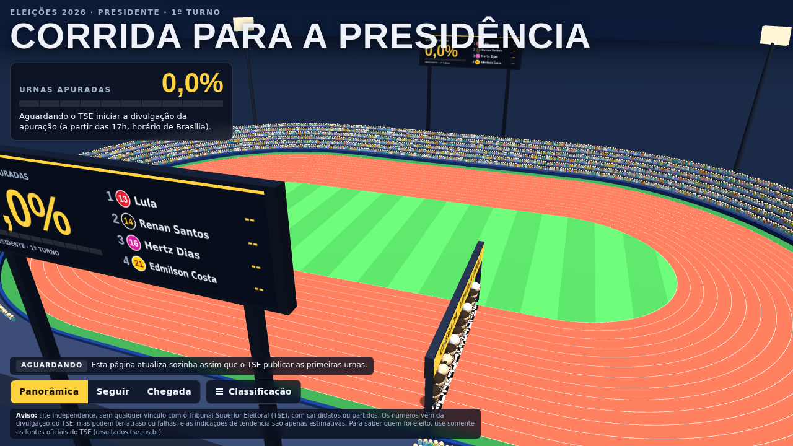
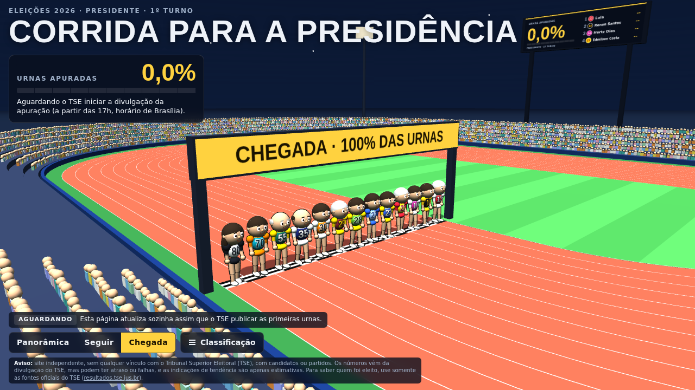
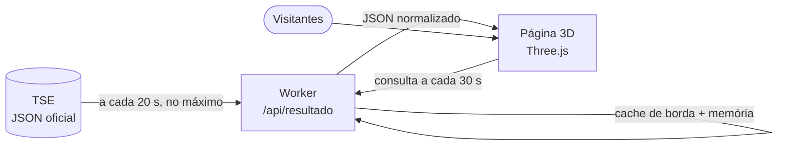

<div align="center">

# 🏃 Corrida para a Presidência

**Acompanhe a apuração das eleições presidenciais de 2026 como uma prova de atletismo em 3D.**

Cada candidato é um corredor. Quanto mais urnas apuradas, mais longe a prova avança.
Todos os números vêm da divulgação oficial do TSE.

[](https://developers.cloudflare.com/workers/)
[](https://threejs.org/)
[](https://resultados.tse.jus.br)
[](#-regras-da-corrida)

**🌐 [corridaparapresidencia.eleicoes.workers.dev](https://corridaparapresidencia.eleicoes.workers.dev)**



</div>

---

## ✨ O que é

Um painel de acompanhamento do **1º turno de 2026** (4 de outubro) em que a apuração vira uma corrida:

- uma **pista de atletismo** (piso vermelho, 13 raias, estádio com arquibancadas, telões e pórtico);
- **13 corredores** caricatos, um por candidato à Presidência, com a **camisa na cor do partido** e o **número de urna** do candidato;
- um **placar ao vivo** com a porcentagem de urnas apuradas, a classificação e um resumo do cenário (disputa aberta, tendência de 2º turno, vitória garantida);
- três câmeras (panorâmica, seguir o líder e chegada) e um painel de classificação que se abre e se fecha com um clique.

> A página **não tem modo de demonstração**: antes do início da apuração os corredores ficam na largada, e assim que o TSE publica os primeiros dados a corrida começa sozinha, sem recarregar.

<div align="center">

</div>

## 📏 Regras da corrida

| Regra | Como funciona |
|---|---|
| **Uma volta = 100% das urnas** | A pista tem 1 volta completa. O líder fica na posição igual à porcentagem de urnas apuradas. |
| **Posição dos demais** | Proporcional aos votos: `posição = % apurada × votos do candidato ÷ votos do líder`. |
| **Número no corredor** | Cada corredor mostra a sua porcentagem de votos válidos, como o site do TSE. |
| **Classificação** | Pelos **votos válidos** de cada candidato. |
| **Cenário** | *Garantido* quando a vantagem é maior que todo o eleitorado ainda não apurado; *tendência* quando supera o dobro dos votos válidos esperados no ritmo atual. Com 100% das urnas, vale o status oficial do TSE (Eleito / 2º turno). |
| **Botão "Vencedores"** | Abre um pódio 3D com o 1º (degrau mais alto) e o 2º colocados. Fica desativado até passar de **99%** das urnas apuradas; se a diferença entre o 1º e o 2º ainda estiver dentro da margem de incerteza dos votos que faltam (o maior entre 10% dos votos válidos restantes e 3,29 desvios-padrão do sorteio multinomial), só libera com **99,99%**. O resultado do pódio é parcial até o TSE divulgar o final. |

## 🗂️ De onde vêm os dados

O site lê o arquivo oficial de resultados do TSE para a eleição federal (presidente, 1º turno):

```
https://resultados.tse.jus.br/oficial/ele2026/6257/dados/br/br-c0001-e006257-u.json
```

O arquivo traz, entre outros campos, os candidatos em `carg > agr > par > cand` (número, nome, votos `vap`, percentual `pvap`, situação `st`) e o andamento da apuração em `s` (seções totalizadas `pst`, `ts`, `st`) e `e` (eleitorado).

## 🧱 Como funciona



- **`public/index.html`**: o site inteiro (3D, interface, candidatos, cores). Roda no navegador, sem build.
- **`src/worker.js`**: Worker da Cloudflare que busca o JSON do TSE, converte a vírgula decimal, normaliza os campos e guarda em cache. Assim, milhares de visitantes geram **no máximo uma consulta ao TSE a cada 20 segundos**, o que respeita o limite do TSE (bloqueio por IP em excesso de requisições).
- **Horário de início**: antes de domingo, 4/10, às 17h (Brasília), nem a página nem o Worker consultam o TSE; a página mostra a contagem regressiva. A rota `/api/verificar` lê o TSE a qualquer momento, para conferir manualmente que a leitura funciona.
- **Falhas do TSE**: o Worker devolve o último dado bom marcado como *"último dado"*; a página nunca inventa números.
- **Atualização automática**: a página consulta o Worker a cada 30 segundos (e ao voltar para a aba), sem recarregar.

## 📁 Estrutura

```
.
├── public/
│   └── index.html          # site: cena 3D, UI, candidatos e cores
├── src/
│   └── worker.js           # /api/resultado e /api/status (TSE → JSON enxuto)
├── docs/                   # imagens deste README
├── wrangler.jsonc          # configuração do Cloudflare Workers
├── verificar_site.py       # teste do site publicado
└── verificar_paleta.py     # confere contraste e daltonismo das cores
```

## 🔧 Se o TSE mudar o endereço do arquivo

Crie a variável `TSE_URL` no Worker (*Configurações → Variáveis e segredos*) com a URL correta e reimplante. Nenhum código precisa mudar.

## 💻 Rodar localmente

```bash
# Worker + site em http://localhost:8787, apontando para o JSON oficial
npx wrangler dev

# ou apontando para um arquivo de teste seu
npx wrangler dev --var TSE_URL:http://127.0.0.1:9911/br-c0001-e006257-u.json
```

## 🎨 Candidatos e cores

Cada candidato tem camisa, cor do número e cor secundária (mangas e calção) no bloco `CANDS` de `public/index.html`. As cores derivam das bandeiras dos partidos e foram conferidas em contraste (WCAG), distância de cor (CIEDE2000) e simulação de daltonismo:

```bash
python3 verificar_paleta.py
```

Os corredores são **personagens genéricos de desenho**, sem a pretensão de retratar o rosto de ninguém: variam apenas em porte, cabelo (ou ausência dele) e cor da camisa.

## ⚠️ Aviso

Este é um projeto **independente, sem qualquer vínculo com o Tribunal Superior Eleitoral (TSE)**, com candidatos ou partidos. Os números vêm da divulgação do TSE, mas podem ter atraso ou falhas, e as indicações de tendência são apenas estimativas. **Para saber quem foi eleito, use somente as fontes oficiais do TSE:** [resultados.tse.jus.br](https://resultados.tse.jus.br).

## 📚 Referências

- [TSE — Divulgação de Resultados](https://resultados.tse.jus.br)
- [Cloudflare Workers — Static Assets](https://developers.cloudflare.com/workers/static-assets/)
- [Cloudflare Workers — Cache API](https://developers.cloudflare.com/workers/runtime-apis/cache/)
- [Cloudflare Workers — Limites e preços](https://developers.cloudflare.com/workers/platform/limits/)
- [Three.js](https://threejs.org/)
- [WCAG 2.1 — Contraste (critério 1.4.3)](https://www.w3.org/TR/WCAG21/#contrast-minimum)
- Sharma, G.; Wu, W.; Dalal, E. N. *The CIEDE2000 color-difference formula*. Color Research & Application, 30(1), 2005.
- Machado, G. M.; Oliveira, M. M.; Fernandes, L. A. F. *A physiologically-based model for simulation of color vision deficiency*. IEEE TVCG, 15(6), 2009.
